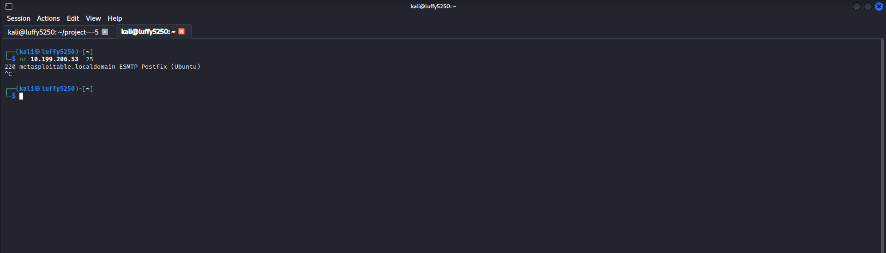
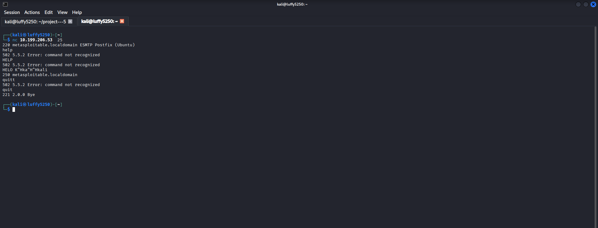
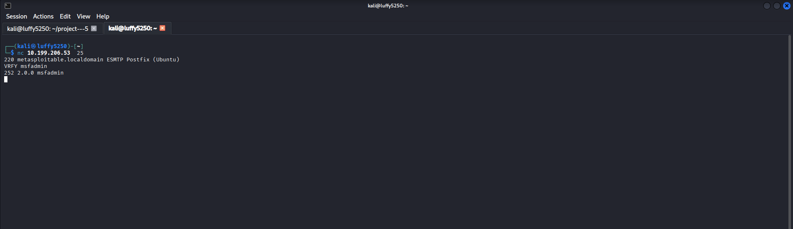
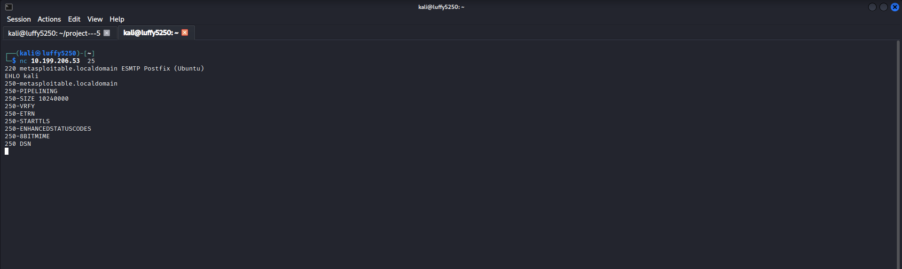
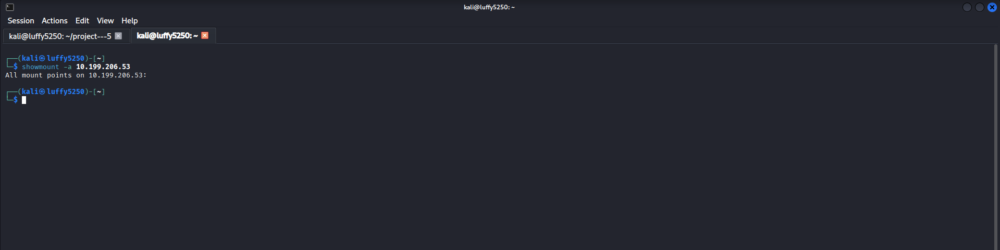
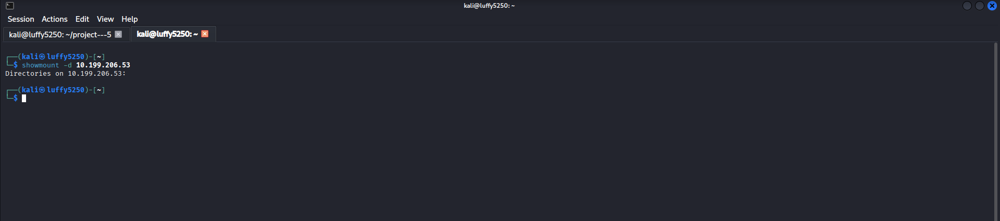
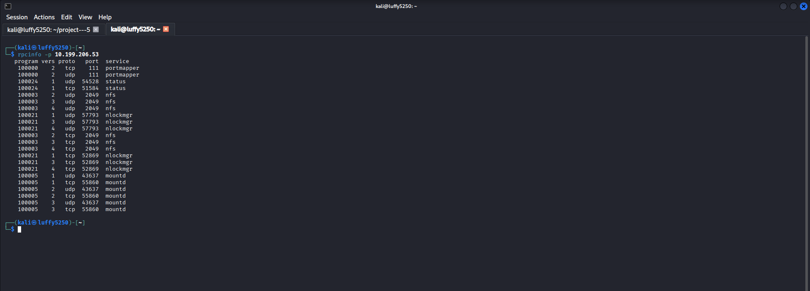

# Part 1 – Introduction to Enumeration & Banner Grabbing

## Objective

My goal is to learn about Enumeration and understand how banner grabbing helps me find out information about services running on a target system. I want to know what Enumeration is and how it works.

---

# What is Enumeration?

Enumeration is when I connect to a target system to get information from the services I found during network scanning. It is different from Footprinting and Scanning because Enumeration actually talks to a service to get information like:

- Hostname

- Operating System

- User Accounts

- Shared Resources

- Service Versions

- Domain Information

I only do Enumeration after I have found hosts and open ports on the target system.

---

# What is Banner Grabbing?

Banner Grabbing is a technique where I connect to a service and read the information it gives me when we connect. The banner might tell me:

- Service Name

- Software Version

- Operating System

- Hostname

- Protocol Information

This information helps people who work in security find problems with the system.

---

## 1. Grab an HTTP Banner

### Scenario

I want to get the HTTP response headers from a web server.

### Command

```bash

curl -I http://scanme.nmap.org

```

### Description

This command shows me the HTTP response headers, which might tell me what web server software is being used and other things.

### Screenshot


---

## 2. Grab a Banner Using Netcat

### Scenario

I want to connect to a web service and ask for the banner manually.

### Command

```bash

nc scanme.nmap.org 80

```

After I connect I type:

```text

HEAD / HTTP/1.1

Host: scanme.nmap.org

```

Then I press **Enter** after the `Host` line.

### Description

This shows me the HTTP response and the server banner.

### Screenshot


---

## 3. Grab an SSH Banner

### Scenario

I want to connect to an SSH service and read the service banner.

### Command

```bash

nc scanme.nmap.org 22

```

### Description

This shows me the SSH version banner that the server sends.

### Screenshot


---

## 4. Identify Supported HTTP Methods

### Scenario

I want to check which HTTP methods a web server supports.

### Command

```bash

curl -X OPTIONS -I http://scanme.nmap.org

```

### Description

This command asks the web server for the HTTP OPTIONS method to see which methods it allows.

### Screenshot


---

# Key Concepts Learned

- Enumeration

- Banner Grabbing

- HTTP Headers

- SSH Banner

- Service Identification

- HTTP Methods

---

# Conclusion

In this part, I learned:

- The difference between scanning and enumeration.
- What banner grabbing is.
- How to identify service information from banners.
- How HTTP and SSH services reveal useful information.
- Why banner grabbing is important before deeper enumeration.

---------------------------------------------------------------------------------------------------------------------------------------------------------------------------------------------------------------------


# Part 2 – SMB & NetBIOS Enumeration

## Objective

I want to learn how to find out about SMB and NetBIOS services on a network. This will help me discover what resources are being shared who the users are, what workgroups are there and what servers are on the network.

---

# What's SMB?

SMB is a way for computers to talk to each other on a network. It is used for:

- Sharing files

- Sharing printers

- Letting people manage computers from away

- Sharing other resources

SMB usually works on:

- TCP Port 445

- TCP Port 139 which is used for NetBIOS

---

# What is NetBIOS?

NetBIOS helps computers on a network find each other and talk to each other. If I look closely I can find out:

- What the computer is named

- What workgroup it belongs to

- What resources are being shared

- Who is logged in

- What kind of operating system it's using

---

## 1. Enume rate SMB Shares

### Scenario

I want to see what SMB shares are available on a computer.

### Command

```bash

smbclient -L <target IP> -N

```

### Description

This command shows me what shared folders are available on the computer. It does this without needing a password.

Replace the IP address with the one I am looking at.

### Screenshot


---

## 2. Perform SMB Enumeration

### Scenario

I want to collect much information as I can about SMB on a computer.

### Command

```bash

enum4linux -a <target IP>

```

### Description

This command tells me about SMB shares, users, groups and NetBIOS. It gives me a lot of information about the computer.

### Screenshot


> **Note:** If I do not have `enum4linux` installed:

```bash

sudo apt install enum4linux

```

---

## 3. Connect to a Shared Folder

### Scenario

I found a shared folder. I want to access it.

### Command

```bash

smbclient //<target IP>/public -N

```

### Description

This command lets me connect to the shared folder without needing a password if that is allowed.

### Screenshot


---

## 4. Enumerate RPC Information

### Scenario

I want to find out more about a computer using the Remote Procedure Call service.

### Command

```bash

rpcclient -U "" -N text<target IP>

```

After I connect:

```text

srvinfo

```

### Description

This command gives me information about the server using the RPC service.

### Screenshot


---

# Key Concepts Learned

- SMB Enumeration

- NetBIOS Enumeration

- Finding Shared Folders

- Accessing things, without a password

- RPC Enumeration

---

# conclusion

In this part I learned:

- How to use SMB enumeration to find shared resources.

- How NetBIOS helps computers talk to each other.

- How to list what SMB shares are available.

- How to get into shared folders.

- How to use RPC to find out about servers.


-------------------------------------------------------------------------------------------------------------------------------------------------------------------------------------------------------------


# Part 3 – SMTP Enumeration

## Objective

I want to learn how to get information from an SMTP service. This will help me understand how a mail server is set up.

---

# What is SMTP Enumeration?

SMTP Enumeration is when you interact with an SMTP server to find out things like:

- What SMTP commands the server supports

- If the server will tell you who the users are

- What kind of mail server software is being used

- What the SMTP banner says

- What the server can do

This helps people who work on security understand how the mail server is set up.

---

# What is SMTP?

SMTP is used to send email between mail servers.

The default port for SMTP is:

- TCP 25

---

## 1. Get the SMTP Banner

### Scenario

I will connect to the SMTP service. Read the server banner.

### Command

```bash

nc <target IP> 25

```

### Description

This connects to the SMTP service. Shows me the banner that the mail server sends back.

I need to replace the IP address with the one I am trying to connect to.

### Screenshot



---

## 2. Show SMTP Help

### Scenario

I want to see what SMTP commands are supported.

### Command

After I connect with Netcat I type:

```text

HELP

```

### Description

This shows me the SMTP commands that the server supports.

### Screenshot



---

## 3. Check if a User Exists

### Scenario

I want to see if a certain username is on the mail server.

### Command

After I connect I type:

```text

VRFY msfadmin

```

### Description

This tries to see if the user I specified really exists.

Some SMTP servers do not allow this for security reasons.

### Screenshot



---

## 4. Show Extended SMTP Features

### Scenario

I want to see what the SMTP server can do.

### Command

After I connect I type:

```text

EHLO kali

```

### Description

This asks the server to show me what SMTP extensions it supports.

### Screenshot



---

# Key Concepts Learned

- SMTP Enumeration

- SMTP Banner

- EHLO

- HELP Command

- VRFY Command

- Mail Server Enumeration

---

# Conclusion

In this part, I learned:

- How to enumerate an SMTP server.
- How to identify supported SMTP commands.
- How SMTP banners reveal server information.
- How EHLO displays server capabilities.
- Why SMTP enumeration is useful during information gathering.


-----------------------------------------------------------------------------------------------------------------------------------------------------------------------------------------------


# Part 4 – NFS Enumeration

## Objective

I want to learn how Network File System (NFS) shares work and how to find the directories that are being shared. 
This is important because if these shared file systems are not set up correctly people with intentions might get access to sensitive information.

---

# What is NFS?

Network File System (NFS) is a way for computers to share files and directories over a network. Network File System (NFS) usually uses:

- Port 2049

- RPC Services

If Network File System (NFS) is not set up correctly attackers might be able to get into the shared directories without needing a password.

---

# What is NFS Enumeration?

NFS Enumeration is the process of finding out what file shares are being exported. If we can get to them. By doing this we can find out:

- What directories are being shared

- What resources are being shared

- Who has permission to access these shared resources

- Information about how these shared resourcesre set up

---

## 1. Display Exported NFS Shares

### Scenario

I need to find out what directories the target Network File System (NFS) server is sharing.

### Command

```bash

showmount -e 192.168.1.10

```

### Description

This command shows all the Network File System (NFS) shares that the target system is exporting. I should replace the IP address with the one I am trying to look at.

### Screenshot


---

## 2. Display All Mount Information

### Scenario

I want to get information about the file systems that are being shared.

### Command

```bash

showmount -a 192.168.1.10

```

### Description

This command shows which computers are connected to the Network File System (NFS) server and what directories they are using. It is like getting a list of who's using what.

### Screenshot



---

## 3. Display Export List Using RPC

### Scenario

I want to ask the mount daemon what is being shared.

### Command

```bash

showmount -d 192.168.1.10

```

### Description

This command shows the directories that the Network File System (NFS) server is sharing. It is like getting a list of what's available.

### Screenshot



---

## 4. Verify RPC Services

### Scenario

I need to find out what RPC services are running on the target computer.

### Command

```bash

rpcinfo -p 192.168.1.10

```

### Description

This command lists all the RPC services that are running including the ones that Network File System (NFS) uses.

### Screenshot



---

# Key Concepts Learned

- Network File System (NFS) Enumeration

- Exported Shares

- RPC Services

- Network File Sharing

- Mount Information

---

# conclusion

In this part I learned:

- How to find the Network File System (NFS) shares that are being exported.

- How to get information, about the mounted file systems.

- How Network File System (NFS) relies on RPC Services.

- Why Network File System (NFS) shares that are not set up correctly can be a security risk.
